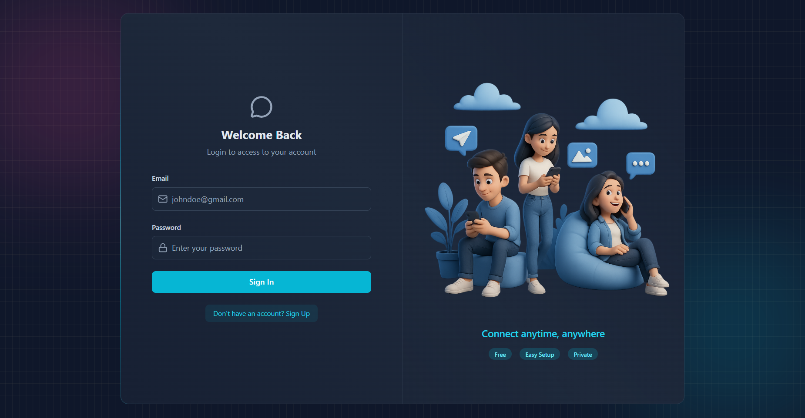
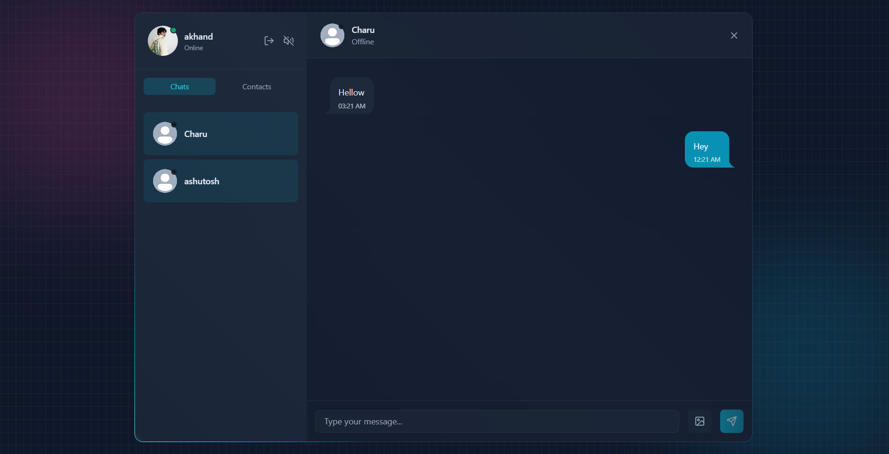
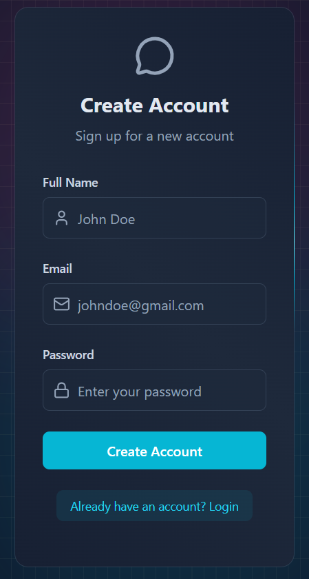
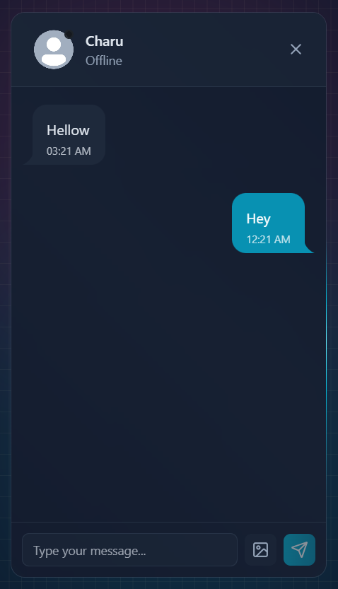
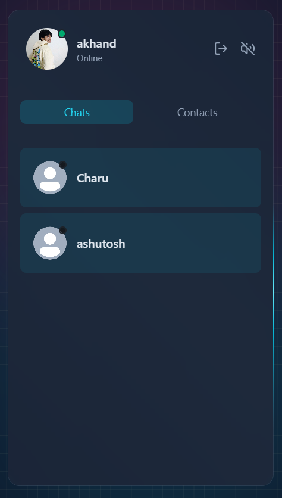

# Real-Time Chat Application
A modern full-stack chat application with real-time messaging, signup emails, custom authentication, media uploads, and a polished responsive UI. Built with clean architecture and production-ready engineering practices.

## 🌟 Features

Custom JWT Authentication (no third-party auth), 
Real-Time Messaging via Socket.io, 
Online / Offline Presence, 
Typing & Message Sounds (toggle), 
Image Uploads (Cloudinary), 
Welcome Emails on Signup (Resend), 
REST API — Node.js + Express, 
MongoDB for Data Persistence, 
API Rate-Limiting (Arcjet), 
Beautiful UI — React, TailwindCSS, DaisyUI, 
Zustand for State Management, 
Easy Deployment (Sevalla free tier friendly)

## 🛠️ Tech Stack

Frontend: React, TailwindCSS, DaisyUI, Zustand \
Backend: Node.js, Express, MongoDB, Socket.io \
Cloud Services: Cloudinary, Resend, Arcjet \
Tools: Git, GitHub, JWT, Sevalla

## 📸 Screenshots
#### Desktop View 

 

#### Mobile View 

   

## 📁 Project Setup

git clone \
cd project \
npm install 

## 📝 .env Setup

### 🔐 Backend (/backend)

```env
PORT=3000
MONGO_URI=your_mongo_uri_here

NODE_ENV=development
JWT_SECRET=your_jwt_secret

RESEND_API_KEY=your_resend_api_key
EMAIL_FROM=your_email_from_address
EMAIL_FROM_NAME=your_email_from_name

CLIENT_URL=http://localhost:5173

CLOUDINARY_CLOUD_NAME=your_cloudinary_cloud_name
CLOUDINARY_API_KEY=your_cloudinary_api_key
CLOUDINARY_API_SECRET=your_cloudinary_api_secret

ARCJET_KEY=your_arcjet_key
ARCJET_ENV=development
```

## 🔧 Run the Backend
cd backend \
npm install \
npm run dev 
## 💻 Run the Frontend
cd frontend \
npm install \
npm run dev

## 👨‍💻 Author

Akhand Pratap Singh \
📩 Email: singhakhands164@email.com \
🔗 LinkedIn: https://www.linkedin.com/in/akhand-pratap-singh164/
